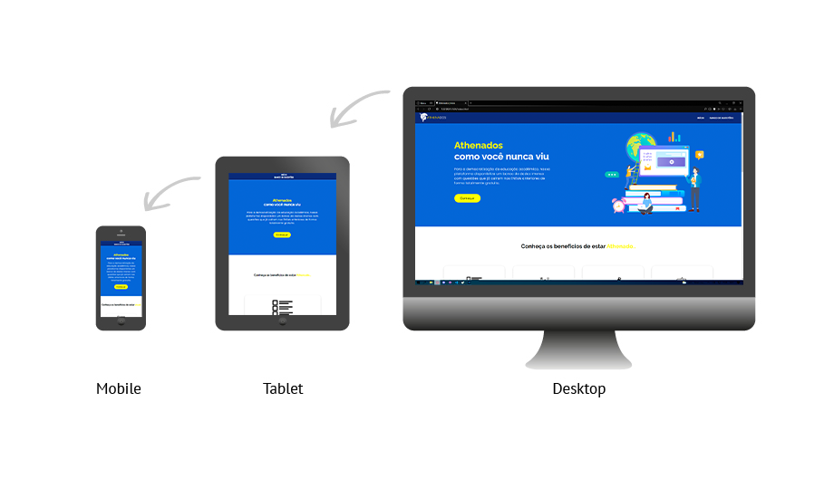

  
  
  
  
 

Athenados is a Brazilian study platform aimed at preparing students for the National High School Exam. Also known nationally as (ENEM). The objective is the democratization of education, aiming to bring equality to Brazilian education. The platform brings all the questions that have already fallen in ENEM for students to practice in the most immersive way possible. 

 
 
 
 
 

  
 
# ABOUT THIS PROJECT
This project was born from an initiative of two high school students who realized the difficulty of democratizing education in Brazil. With Athenados, students of all incomes can access a completely free database on all platforms. Athenados is a completely free platform in which there is a collection of exercises for all subjects that fall into the ENEM (in Brazil, the ENEM is a very important test that determines whether high school students will or will not enter a university).

 
 
 ## ATHENADOS FREATURES
  
 
 #### Responsive Layout
 
 

 #### Easily access
  
 
 
 
 #### Totally free

 

 #### Questions with comments

 
 

 #### Intuitive layout

 
 
  
  
  
  
 
 ## WHAT CAN ATHENADOS DO?
> You can study for free
>
> You can practice question exercises
>
> You can pass a good university.
>
> You can't bake a cake (; ′⌒`)
 
  
  

 ## WHOY DOES THIS PROJECT EXIST?
As stated earlier, Brazilian education is precarious and completely unequal. Our initiative aims to raise awareness and encourage one or more developers with projects focused on social welfare. As digital natives, the developers of these projects seek that this way there is more social harmony and that this way we can influence more people to participate in these projects, feel free to fork, star or publicize the initiatives for good.

 
  
  

 ## PROJECTS NOTES
	

- As it is an initial project, the panel of questions is not large, with a maximum of 20 questions each subject.
- To run the project easily, access the link: [yagopeixinho.github.io/athenados/](yagopeixinho.github.io/athenados/)
- 

 

 
  
  
 
 ## CONTACT

 

 
 If you liked the project or have any constructive criticism related to the project or want to get in touch for some other reason or just want to help the developers and the project, here are some options:
	
- 🌎 Share this repository with your friends!
- 📷 Follow the developers on instagram and github: [Yago Peixinho](https://www.instagram.com/yagopeixinho/?hl=pt-br), [Yuri Peixinho](https://www.instagram.com/peixinhoyuri/?hl=pt-br)
- ⭐ If you liked the idea, you can give it a fork and a star.
- 📬 Email the developments if you need something: yagopeixinho03@gmail.com & yuripeixinho03@gmail.com
 
 

 
 ## CONTRIBUTORS
 
 

 
<table align="center">
<tr>
   <td align="center"> 
		<a href="https://github.com/yagopeixinho">
			      
   
		
					<b>Yago Peixinho</b>
		
		</a> 
	</td> 
<td align="center" >
		<a href="https://github.com/yagopeixinho">
			             
   
	  
	  <b>Yuri Peixinho</b>
	  
	  </a>       
 </td>    

</tr>
   </table>
 
 
